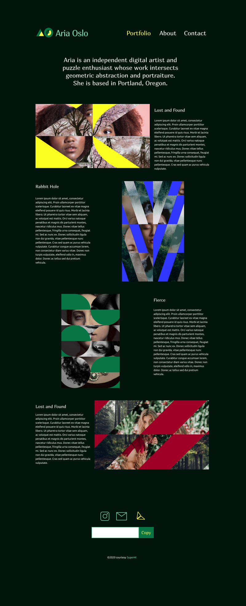

## Aria's Portfolio website
### About project
My version of Aria Oslo's website built while taking the superhi plan, design + code your first website course. Built with html, 
css and vanilla javascript. Has three pages: portfolio page, about page and contact page. 
View live on [Github Pages](https://ifycode.github.io/Aria-portfolio/).

### Design 
About page mockup below. Other pictures uploaded on [Figma](https://www.figma.com/file/KRRpjgwgBh9qvBHfEteris/Ario-Oslo?node-id=30%3A4). Mockup for larger devices only 
and designed with Figma.

